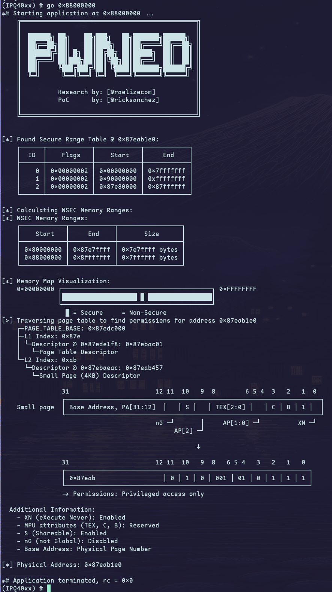
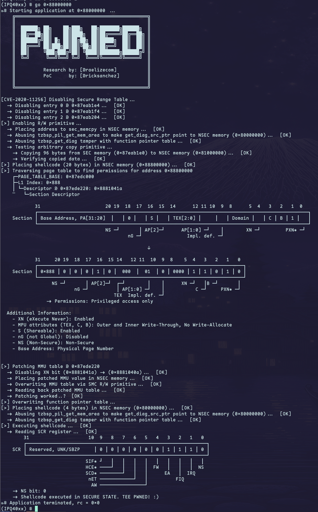

# QSEE Exploit PoC

## Overview

This repository contains a Proof of Concept (PoC) that demonstrates an exploit of the Qualcomm Secure Execution Environment (QSEE) in ARM TrustZone. The exploit allows for arbitrary code execution with TrustZone privileges on supported devices. The PoC was developed on a LinkSys AC2200 router. However the general idea of this exploit seems to be working on any Qualcomm IPQ40XX chipsets.

**Disclaimer**: This research is based on public knowledge and is implemented for educational purposes to understand QSEE/TrustZone vulnerabilities. The original research was conducted by [raelize](https://raelize.com/blog/qualcomm-ipq40xx-an-unexpected-cup-of-tee/), which I highly recommend checking out.

## Features

- Exploitation of QSEE vulnerabilities
- Demonstration of arbitrary code execution from TrustZone
- SVC (Supervisor Call) enumeration
- Visualization of secure memory ranges

## Prerequisites

- Docker

## Building the Exploit

The exploit code is located in `hello-world.c` and is compiled as a standalone executable using the [Caraboot](https://github.com/8devices/Caraboot-ipq) stack.
The exploit should be compilable with any other stack that allows building an ARMv7 32-bit little-endian standalone applications and links against U-Boot.

```sh
docker build -t ipq40xx_expl . -f Dockerfile
./run.sh
```

_Note_: The `./run.sh` mounts the host directory `/srv/tftp/` to `/out` inside the container. If you do not have that directory modify the script, because that host location is used to store the compiled exploit.

## Showcase

- SVC enum:


- Secure ranges visualization:



- Code execution PoC:



## Disclaimer

This project is for educational and research purposes only. The authors are not responsible for any misuse or damage caused by this software. Always obtain proper authorization before testing on any systems you do not own or have explicit permission to test.
